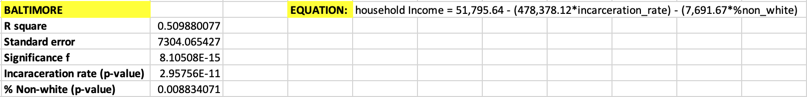
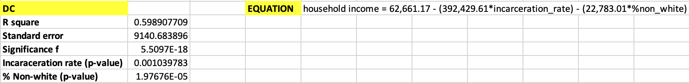

# Determining the Effect of Racial Demographics and Incarceration Rate on Household Income

## Background

Recently, I completed a project that analyzed the relationship between incarceration rates and household incomes in Baltimore, Maryland and Washington, D.C. The resulting combination graphs can be found [here](https://github.com/a31kim/baltimoredc-male-incarceration-income/tree/master/.gitbook/assets): there is a clear and obvious visual correlation between the two variables. However, my data analysis lacked a quantitative backing for this qualitative assertion. In this project, I will determine the numerical correlation between incarceration rates and household income, while additionally including racial demographics as a dependent variable.

I decided to include this variable to see if additional correlation existed between the community's percentage of non-white residents and its average annual household income. Having recently fnished Michelle Alexander's _The New Jim Crow_, I already possessed an underlying notion that high rates of incarceration in predominantly non-white communities would be linked to reduced economic opportunity and income. However, I wanted to examine the public data myself, to get a sense of the numerical extent of this relationship.

As per my previous project, the two cities examined in this data analysis are Baltimore, Maryland and Washington, D.C. Both cities present similar instances of underprivileged, predominantly non-white communities existing alongside gentrified neighborhoods with higher average incomes and far lower incarceration rates. However, no two cities possess the exact same policies or demographics, so it will be interesting to see if there is any noticable difference between the two datasets. Using data provided by [The Opportunity Atlas](https://www.opportunityatlas.org/), this project will analyze quantitative data to try and validate the qualitative assertion that incarceration rates and racial demographics are significantly correlated with household incomes in both Baltimore and D.C.

## Business Question
_**What, if any, is the relationship between incarceration rates/racial demographics and household income in Baltimore and D.C.?**_

## Data Question - Open Data

All of the data used in this project was gathered from [The Opportunity Atlas](https://www.opportunityatlas.org/).
The folder containing the original data files can be found in the repository [here](https://github.com/a31kim/regression-income-nonwhite-incarceration/tree/master/original_data), or individually below.

1. [Baltimore Incarceration Rates](https://github.com/a31kim/regression-income-nonwhite-incarceration/blob/master/original_data/balti_INCARC.xlsx)
2. [Baltimore % Non-White](https://github.com/a31kim/regression-income-nonwhite-incarceration/blob/master/original_data/balti_%25NW.xlsx)  
3. [Baltimore Household Income](https://github.com/a31kim/regression-income-nonwhite-incarceration/blob/master/original_data/balti_%24.xlsx)
4. [DC Incarceration Rates](https://github.com/a31kim/regression-income-nonwhite-incarceration/blob/master/original_data/dc_INCARC.xlsx)
5. [DC % Non-White](https://github.com/a31kim/regression-income-nonwhite-incarceration/blob/master/original_data/dc_%25NW.xlsx)
6. [DC Household Income](https://github.com/a31kim/regression-income-nonwhite-incarceration/blob/master/original_data/dc_%24.xlsx)

## Data Question - Open Data
_All data used in this project is from [The Opportunity Atlas](https://www.opportunityatlas.org/)._

**The Opportunity Atlas** seeks to answer the question: "Which neighborhoods in America offer children the best chance at a better life than their parents?". In an attempt to gauge the relative social mobility of these communities, they have gathered anonymous data from over 20 million Americans, tracking them from their childhood to their mid-thirties.

## Data Question - Analysis

Microsoft Excel was used to answer:
* **What is the correlation between incarceration rates/racial demographics and household income in Baltimore and D.C.?** Performing multiple linear regression to produce an equation that produces a _y-value_ of household income, using incarceration rates and percentage of non-white residents as the _x-values_.
* **Are both variables significant?** Analyzing the _p-values_ and _significance f_ values in order to determine whether or not both variables can be deemed as significant.
* **Is the regression model an accurate representation of the data?** Analyzing the standard errors and r-square values to determine the accuracy of the regression model presented by the data analysis.

## Data Answer

The data is difficult to display graphically due to the multi-variable nature of the dataset. Instead, I have picked out a few key variables to highlight the significance of the dependent variables, and their correlation with the independent variables.

### Baltimore, MD

The full Baltimore dataset used for the regression can be found [here](https://github.com/a31kim/regression-income-nonwhite-incarceration/blob/master/compiled_analysis.xlsx), in the "balti_compiled_data" sheet. The complete set of regression values can be found [here](https://github.com/a31kim/regression-income-nonwhite-incarceration/blob/master/compiled_analysis.xlsx), on the left-side of the "regression" sheet.

Below is a table displaying the key values extracted from the Baltimore data regression, along with an equation detailing the numerical relationship between the values.

**Observations from this dataset:**
* The _r-square_ value is not particulary large, but it is larger than 0.5, indicating a relatively decent regression model fit.
* The _standard error_ is perhaps worth nothing, considering the household income dataset only ranges from ~$20,000 to ~$70,000.
* The _significance f_ value is extremely small, firmly rejecting the null hypothesis that neither dependent variable contributes to the independent variable.
* Both of the dependent variables' _p-values_ are smaller than 0.05, meaning that they are both significant.

The above observations demonstrate the adequate significance of the data. The regression model determined by this dataset indicates that both the incarceration rate and percentage of non-white residents has a significant negative impact on an area's predicted household income. The coefficients in the formula (-478,378 for incarceration, -7,692 for non-white) numerically demonstrate this conclusion.

### Washington, D.C.

The full D.C. dataset used for the regression can be found [here](https://github.com/a31kim/regression-income-nonwhite-incarceration/blob/master/compiled_analysis.xlsx), in the "dc_compiled_data" sheet. The complete set of regression values can be found [here](https://github.com/a31kim/regression-income-nonwhite-incarceration/blob/master/compiled_analysis.xlsx), on the right-side of the "regression" sheet.

Below is a table displaying the key values extracted from the Baltimore data regression, along with an equation detailing the numerical relationship between the values.

**Observations from this dataset:**
* The _r-square_ value is not particulary large, but it is larger than 0.5, indicating a relatively decent regression model fit.
* The _standard error_ is perhaps worth nothing, considering the household income dataset only ranges from ~$20,000 to ~$80,000.
* The _significance f_ value is extremely small, firmly rejecting the null hypothesis that neither dependent variable contributes to the independent variable.
* Both of the dependent variables' _p-values_ are smaller than 0.05, meaning that they are both significant.

The above observations demonstrate the adequate significance of the data. The regression model determined by this dataset indicates that both the incarceration rate and percentage of non-white residents has a significant negative impact on an area's predicted household income. The coefficients in the formula (-392,430 for incarceration, -22,783 for non-white) numerically demonstrate this conclusion.

## Data Application and Business Answer

The data analysis presented in this project numerically demonstrates the qualitative assertion that racial demographics and incarceration rates of an area are significantly correlated with its predicted average household income. While it would be too presumptive to describe this relationship as causal, it is worth noting the incidence of mass incarceration and significant racial discrimination in many metropolitan areas. The regression model implies that communities with higher rates of non-white residents and incarceration are much more likely to have limited access to the same economic opportunities available to more white, lower crime areas within the same city. It is perhaps worth investigating the mutli-faceted nature of this phenomenon, such as the role of inadequate educational and employment services.

In addition to the general conclusions that can be drawn from this project, a comparison between the two cities' regression models yields an interesting difference worth noting. Compared to D.C., the equation produced by the Baltimore dataset regression indicates a much smaller effect of the percentage of non-white residents on income. In short, race seems to play a much larger role in determining household income in D.C. than in Baltimore. While this project does not currently seek to examine the reasoning behind this, it could possibly be related to the lower percentage of Whites in Baltimore [29.6%](https://en.wikipedia.org/wiki/History_of_White_Americans_in_Baltimore#:~:text=By%20the%201990%20United%20States,%25%20was%20non%2DHispanic%20white.) compared to [42.2%](https://en.wikipedia.org/wiki/Demographics_of_Washington,_D.C.#:~:text=According%20to%202018%20US%20Census,from%20two%20or%20more%20races.) in D.C. Perhaps the larger population of non-whites in Baltimore has simply resulted in a larger dispersion of income across the group.

In summation, this data analysis has effectively demonstrated a significant relationship between racial demographics/incarceration rates, and average household income. The sharp contrast between neighborhoods in D.C. like Georgetown ($67,000 average income, 0.5% incarceration, 14% non-white) and Brightwood Park ($30,830 average income, 3.6% incarceration, 95% non-white) is clear. The same dichotomy exists in Baltimore, with neighborhoods like Mount Washington ($70,000 average income, ~0% incarceration, 20% non-white) and Lakeland ($26,000 average income, 3.6% incarceration, 78% non-white). Anecdotal evidence aside, racial demographics and incarceration rates are clearly directly correlated with the average household income of an area in these two cities.

