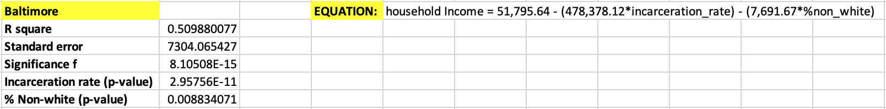

# Determining the Effect of Racial Demographics and Incarceration Rate on Household Income

## Background

Recently, I completed a project that analyzed the relationship between incarceration rates and household incomes in Baltimore, Maryland and Washington, D.C. The resulting combination graphs can be found [here](https://github.com/a31kim/baltimoredc-male-incarceration-income/tree/master/.gitbook/assets): there is a clear and obvious visual correlation between the two variables. However, my data analysis lacked a quantitative backing for this qualitative assertion. In this project, I will determine the numerical correlation between incarceration rates and household income, while additionally including racial demographics as a dependent variable.

I decided to include this variable to see if additional correlation existed between the community's percentage of non-white residents and its average annual household income. Having recently fnished Michelle Alexander's _The New Jim Crow_, I already possessed an underlying notion that high rates of incarceration in predominantly non-white communities would be linked to reduced economic opportunity and income. However, I wanted to examine the public data myself, to get a sense of the numerical extent of this relationship.

As per my previous project, the two cities examined in this data analysis are Baltimore, Maryland and Washington, D.C. Both cities present similar instances of underprivileged, predominantly non-white communities existing alongside gentrified neighborhoods with higher average incomes and far lower incarceration rates. However, no two cities possess the exact same policies or demographics, so it will be interesting to see if there is any noticable difference between the two datasets. Using data provided by [The Opportunity Atlas](https://www.opportunityatlas.org/), this project will analyze quantitative data to try and validate the qualitative assertion that incarceration rates and racial demographics are significantly correlated with household incomes in both Baltimore and D.C.

## Business Question
_**What, if any, is the relationship between incarceration rates/racial demographics and household income in Baltimore and D.C.?**_

## Data Question - Open Data

All of the data used in this project was gathered from [The Opportunity Atlas](https://www.opportunityatlas.org/).
The original data files can be found in the repository [here](https://github.com/a31kim/regression-income-nonwhite-incarceration/tree/master/original_data).

1. [Baltimore Incarceration Rates](https://github.com/a31kim/regression-income-nonwhite-incarceration/blob/master/original_data/balti_INCARC.xlsx)
2. [Baltimore % Non-White](https://github.com/a31kim/regression-income-nonwhite-incarceration/blob/master/original_data/balti_%25NW.xlsx)  
3. [Baltimore Household Income](https://github.com/a31kim/regression-income-nonwhite-incarceration/blob/master/original_data/balti_%24.xlsx)
4. [DC Incarceration Rates](https://github.com/a31kim/regression-income-nonwhite-incarceration/blob/master/original_data/dc_INCARC.xlsx)
5. [DC % Non-White](https://github.com/a31kim/regression-income-nonwhite-incarceration/blob/master/original_data/dc_%25NW.xlsx)
6. [DC Household Income](https://github.com/a31kim/regression-income-nonwhite-incarceration/blob/master/original_data/dc_%24.xlsx)

## Data Question - Open Data
_All data used in this project is from [The Opportunity Atlas](https://www.opportunityatlas.org/)._

**The Opportunity Atlas** seeks to answer the question: "Which neighborhoods in America offer children the best chance at a better life than their parents?". In an attempt to gauge the relative social mobility of these communities, they have gathered anonymous data from over 20 million Americans, tracking them from their childhood to their mid-thirties.

## Data Question - Analysis

Microsoft Excel was used to answer:
* **What is the correlation between incarceration rates/racial demographics and household income in Baltimore and D.C.?** Performing multiple linear regression to produce an equation that produces a _y-value_ of household income, using incarceration rates and percentage of non-white residents as the _x-values_.
* **Are both variables significant?** Analyzing the _p-values_ and _significance f_ values in order to determine whether or not both variables can be deemed as significant.
* **Is the regression model an accurate representation of the data?** Analyzing the standard errors and r-square values to determine the accuracy of the regression model presented by the data analysis.

## Data Answer

The data is difficult to display graphically due to the multi-variable nature of the dataset. Instead, I have picked out a few key variables to highlight the significance of the dependent variables, and their correlation with the independent variables.

### Baltimore, MD

The full Baltimore dataset used for the regression can be found [here](https://github.com/a31kim/regression-income-nonwhite-incarceration/blob/master/compiled_analysis.xlsx), in the "balti_compiled_data" sheet. The complete set of regression values can be found [here](https://github.com/a31kim/regression-income-nonwhite-incarceration/blob/master/compiled_analysis.xlsx), in the "regression" sheet.

Below is a table displaying the key values extracted from the Baltimore data regression, along with an equation detailing the numerical relationship between the values.

**Observations from this dataset:**
* The _r-square_ value is not particulary large, but it is larger than 0.5, indicating a relatively decent regression model fit.
* The _standard error_ is perhaps worth nothing, considering the household income dataset only ranges from ~$20,000 to ~$70,000.
* The _significance f_ value is extremely small, firmly rejecting the null hypothesis that neither dependent variable contributes to the independent variable.
* Both of the dependent variables' _p-values_ are smaller than 0.05, meaning that they are both significant.

The regression model determined by this dataset indicates that both the incarceration rate and percentage of non-white residents has a significant negative impact on an area's predicted household income. The coefficients in the formula (-478,378 for incarceration, -7,692 for non-white) numerically demonstrate this conclusion.

### Washington, D.C.

The compiled dataset

This graph clearly displays a negative relationship between incarceration rates and household income. Communities like Georgetown and the Naval Observatory have significantly higher incomes and much lower incarceration rates than areas like Barry Farm and the Capitol Riverfront.

#### Other Data

Looking at each neighborhood/area individually and examining its relationship between these two metrics was very interesting. The large data set is a little too large and unruly to display in this brief report, but you can view the data and the graphs yourself [here](https://github.com/a31kim/baltimoredc-male-incarceration-income/blob/master/comparison.xlsx).

## Data Application

The data analysis presented in this project adequately demonstrates the widely assumed negative relationship between household income and incarceration rates. The data does not seem to indicate any difference between Baltimore and D.C. in this regard, as the cities displayed very similar relationships. Upon researching some of the more prominent examples, such as those mentioned above, the vast majority of the low-income, high-incarceration communities were in low-educated, underprivileged areas. This is not particularly surprising, but the direct correlation is very interesting in regards to the issue of social mobility and community betterment.

It may have been helpful to have some additional data on the number of crimes committed annually in each area, to get a sense of the relative risk in each community as context for the incarceration data. It would also be interesting to compare this data with the relative primary/secondary education opportunities provided in each area.

As a resident of both cities, I think that it's important to remain cognizant of the entire city's populace, rather than just focusing on your own little bubble. Being a college student in Baltimore is a unique privilege, and analyzing data like this is a reminder of how amazing and rare an opportunity like this is.

